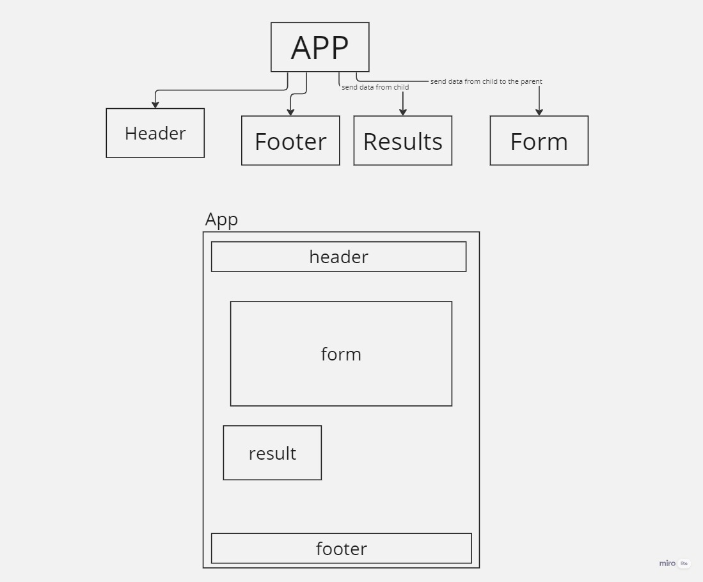

# Lab 26
- UML diagram: 

_ _ _ 
- Screen shot of the output:

_ _ _
- simple describtion for the lab:

* App.js is the main entry point of the React application,it imports necessary components: Header, Footer, Form, and Results.
* Uses useState to manage data and requestParams state variables.
* Defines a callApi function that updates state with mock data.
* Renders the Header, displays request method and URL, renders the Form, shows Results, and renders the Footer.
_ _ _ 
* The Form component displays a form for submitting API requests.
* Uses useState to manage the URL input field.
* Calls a function handleSubmit on form submission to update parent component with form data.
* Provides options for HTTP methods (GET, POST, PUT, DELETE).
_ _ _
* The Results component displays API response data in a pre-formatted section.
* It takes data as a prop and renders JSON data if available, or nothing if data is null.
_ _ _
Overall, the application uses React function components and useState for state management. It displays a simple interface where users can input API URLs, choose HTTP methods, and see mock API response data. Components are styled using SCSS files for a clean and visually appealing user experience.
_ _ _
...