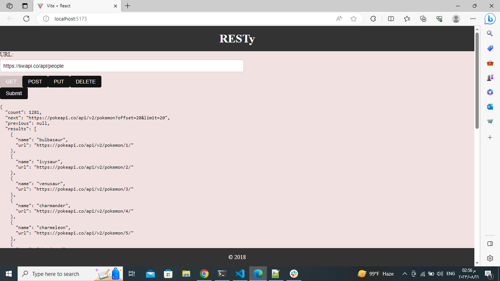
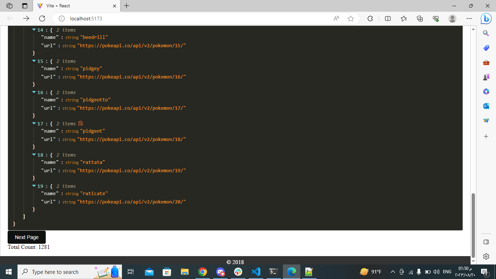

# Lab 27:

## Result:

## Documentation:
* App.js
App.js is the main entry point of our React application. It brings together different components to create the complete user interface. It imports and renders the following components:

Header: A component that displays the header of our app.
Form: A component that provides a form for users to input data and make API requests.
Results: A component that displays the response from the API request or a loading message.
Footer: A component that displays the footer of our app.

Inside the App function, I manage the state of the request, response, and loading status.I define a function called handleFormSubmit to handle form submissions. This function makes an API request based on user input and updates the state accordingly.

* Form.jsx
Form.jsx is a component responsible for rendering a form where users can input the URL, select a request method (GET, POST, PUT, DELETE), provide a request body (if applicable), and submit the form. It consists of the following parts:

* Results.jsx
Results.jsx is a component that displays the response from the API request or a loading message.This component provides feedback to the user about the status of the API request and displays the results once they are available.

These three components work together to create a simple application where users can input an API URL, select a request method, and view the API response or loading status. The App.js component manages the overall state and logic, while the Form.jsx component handles user input and the Results.jsx component displays the output.

### testing:
I write a test file for each unit ,but i faced these errors :

- SyntaxError: JSX not enabled: This error occurs because JSX (JavaScript XML) syntax is not enabled in your Jest test file. JSX is a syntax extension for writing HTML-like code within JavaScript. To fix this, you need to ensure that your test file supports JSX. In your package.json file, make sure you have configured Jest's transform option to transform files with .jsx extension using babel-jest.

- ReferenceError: document is not defined: This error happens when you try to use the render function from the @testing-library/react library, which relies on the document object. However, the document object is not available in the Node.js environment where your tests are running. To solve this, you need to configure Jest to use a browser-like environment (jsdom) where the document object is available. In your package.json file, add "testEnvironment": "jsdom" to your Jest configuration.

i searched on (chatgpt/stck over flow/geeks for qeeks) to slove the errors,but all solutions didnt solve the problem.

### Sand box:

